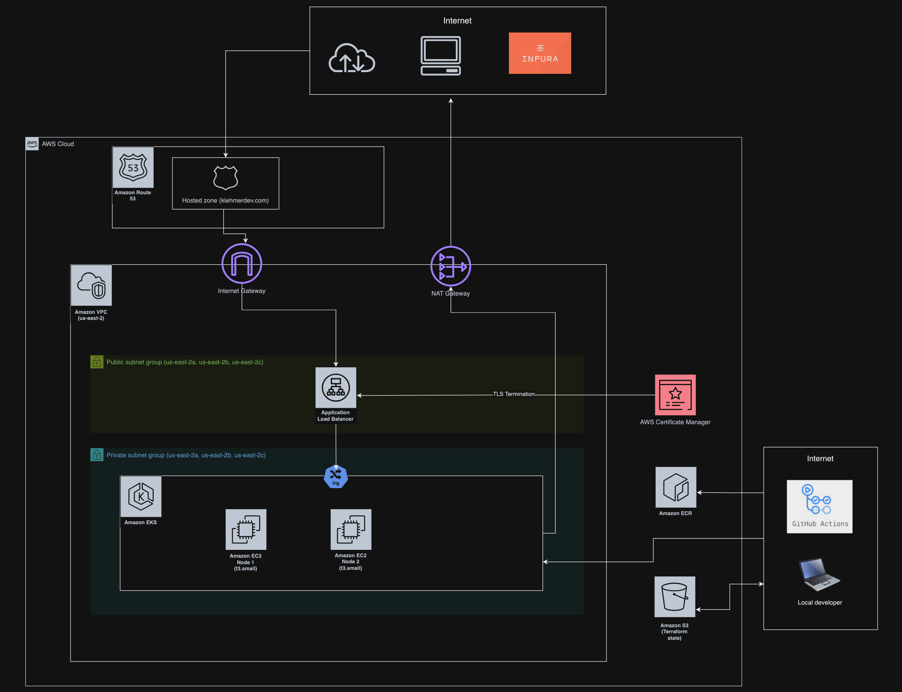
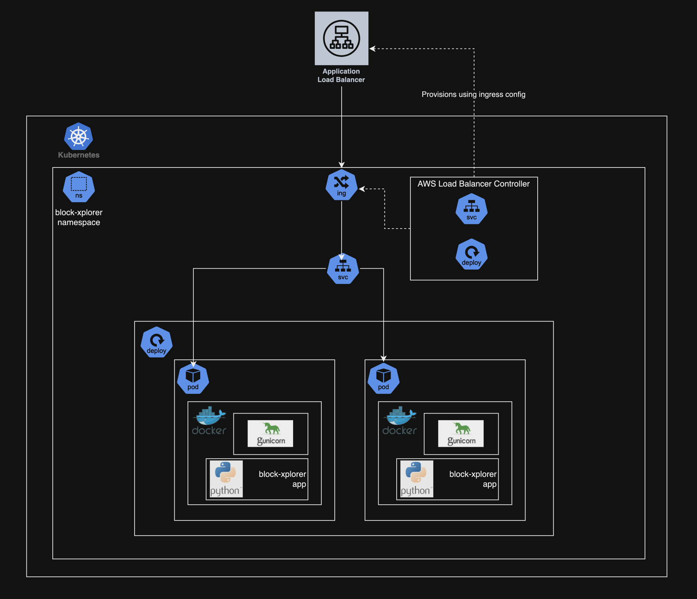

# block-xplorer

## Routes
/balance - Retrieve single balance using path parameter
[https://klehmerdev.com/balance/0xc94770007dda54cF92009BFF0dE90c06F603a09f](https://klehmerdev.com/balance/0xc94770007dda54cF92009BFF0dE90c06F603a09f)

/balances - Retrieve multiple balances using query parameter
[https://klehmerdev.com/balances?address=0xc94770007dda54cF92009BFF0dE90c06F603a09f&address=invalid_address](https://klehmerdev.com/balances?address=0xc94770007dda54cF92009BFF0dE90c06F603a09f&address=invalid_address)

/healthz - Health check
[https://klehmerdev.com/healthz](https://klehmerdev.com/healthz)

## Tools

The following tools were installed for development and testing.
- `brew install awscli`
- `brew install kubectl`
- `brew install docker`
- `brew install eksctl` (optional)
- `brew install terraform-docs` (optional)

## [Terraform Directory](https://github.com/klehmer/block-xplorer/tree/main/terraform)
This directory contains the Terraform IaC code that defines the cloud infrastructure layer of the application.

Version 1.5.7 of Terraform is used.

To boostrap the terraform state create a `secrets.auto.tfvars` file with the following secret values and run a local apply (optionally, target only the resources in `github_actions.tf`).
- `aws_access_key_id` - AWS access key id
- `aws_secret_access_key` - AWS secret access key
- `infura_api_key` - API key created from Infura account
- `github_token` - Github access token for provisioning repo secrets and vars

Once the values are loaded into the github actions secrets/vars, Terraform plans/applies can be run from the `terraform-apply.yaml` Github action workflow.

## [K8s Directory](https://github.com/klehmer/block-xplorer/tree/main/k8s)
This directory contains the manifests for the K8s service and deployment for the application.

## [python Directory](https://github.com/klehmer/block-xplorer/tree/main/python)
This directory contains the python app and test files. The app runs locally using Flask on Python 3.9. It is built into a Docker image running on gunicorn.

## [.github/workflows Directory](https://github.com/klehmer/block-xplorer/tree/main/.github/workflows)
This directory contains the Github actions workflow files for each of the above directories. All workflows are triggered when changes are made on the `main` branch in their respective directories.

### app-deploy.yaml
This workflow contains 3 jobs that trigger when changes are made to any files in the `/python` directory:
- The first runs unit tests against the python app code. If any test fails, the entire workflow fails
- The second builds and pushes the images to an AWS ECR repo
- The third deploys the new image to the K8s cluster (only if the first two jobs are successful)

### k8s-deploy.yaml
This workflow contains a single job that applies the manifests into the K8s cluster when changes are made to any files in the `/k8s` directory.

### terraform-apply.yaml
This workflow contains two jobs that trigger when changes are made to any files in the `/terraform` directory:
- The first job runs a `terraform plan` that outputs to the console and detects if any changes are present.
- If changes are detected, the second job is kicked off. This job requires a manual approval and then runs a `terraform apply` to apply the changes.
- If no changes are detected the second job is skipped and the workflow terminates.

## Cloud Architecture

## K8s Architecture

